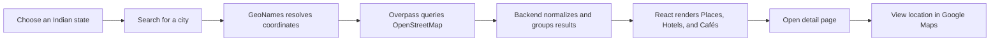

# ExplorePlace — Discover the Best of India

<div align="center">
  

  <br />

  **A full-stack travel discovery platform for finding attractions, stays, cafés, and restaurants across Indian cities.**

  <br />

  
  
  
  
</div>

## Overview

ExplorePlace makes travel research simpler by bringing the most useful parts of city discovery into one responsive experience. Select an Indian state, search for a city, and instantly explore nearby tourist attractions, hotels, cafés, and restaurants.

The application combines live geographic data with a modern card-based interface, dedicated detail pages, Google Maps directions, resilient API fallbacks, and session-aware navigation.

## Highlights

- **Pan-India city discovery** — Search cities across all Indian states and union territories.
- **Live nearby recommendations** — Discover attractions, accommodation, cafés, and restaurants within a 10 km radius.
- **Rich detail pages** — Display every available OpenStreetMap field, including timings, contact details, cuisine, accessibility, operator, website, and coordinates.
- **Google Maps integration** — Open any selected destination directly in Google Maps using its name and address.
- **Smart navigation state** — State, city, results, counts, and scroll position survive navigation to a detail page and back.
- **Resilient image experience** — Unique source images are retained; repeated or missing images rotate through category-specific visual sets.
- **Responsive travel UI** — Scenic hero, asynchronous city selector, animated interactions, mobile navigation, live counts, and responsive cards.
- **Admin data-entry tools** — Separate forms for maintaining locations, places, hotels, and restaurants in MongoDB.
- **Optional Google Places support** — Backend endpoints are available for richer Google Places results and photo proxying when an API key is configured.

## How It Works



GeoNames handles city autocomplete and coordinates. The backend then queries OpenStreetMap through the Overpass API, normalizes inconsistent community data, removes duplicate results, classifies each location, and returns presentation-ready JSON to the React client.

## Technology Stack

| Layer | Technologies |
| --- | --- |
| Frontend | React 19, React Router, Axios, React Bootstrap, React Select |
| UI and motion | Framer Motion, Lucide React, React Icons, Three.js, React Three Fiber |
| Backend | Node.js, Express 5 |
| Database | MongoDB, Mongoose |
| Uploads | Multer, Express static files |
| External data | GeoNames, OpenStreetMap Overpass API, optional Google Places API |
| Testing/build | React Testing Library, Jest, Create React App |

## Engineering Decisions

### Free-first discovery pipeline

The primary user flow uses GeoNames and OpenStreetMap, allowing broad geographic discovery without making the experience dependent on a paid places provider. Multiple Overpass servers are configured as fallbacks for better availability.

### Defensive data normalization

Open geographic data varies between locations. The backend safely normalizes tags and only exposes optional details when they exist. The frontend conditionally renders these fields instead of showing empty placeholders.

### Lightweight caching

External city and place responses are cached in memory to reduce repeated network requests. Browser `sessionStorage` preserves the active discovery session and restores the exact result position after viewing a card.

### Image fallback strategy

When many OpenStreetMap records share the same fallback image, the frontend rotates four category-specific images. Genuine unique images from the source remain untouched.

## Project Structure

```text
BestLocation/
├── backend/
│   ├── config/          # Database and upload configuration
│   ├── controllers/     # GeoNames, OSM, Google Places and MongoDB logic
│   ├── models/          # Location, Place, Hotel and Cafe schemas
│   ├── routes/          # Express API routes
│   ├── uploads/         # Locally uploaded images
│   └── server.js        # Backend entry point
│
└── bestlocationfinder/
    ├── public/          # Static assets
    └── src/
        ├── Components/  # Navbar, hero, cards, footer and visual effects
        ├── data/        # Indian states and sample data
        ├── pages/       # Public, detail and admin pages
        ├── App.js       # Client-side routes
        └── config.js    # Frontend API configuration
```

## Getting Started

### Prerequisites

- Node.js 18 or newer
- npm
- A local or hosted MongoDB database
- A GeoNames account for production usage
- A Google Maps API key only if using the optional Google Places endpoints

### 1. Clone the repository

```bash
git clone <your-repository-url>
cd BestLocation
```

### 2. Configure the backend

```bash
cd backend
npm install
```

Create `backend/.env`:

```env
PORT=5000
MONGO_URI=your_mongodb_connection_string
GEONAMES_USERNAME=your_geonames_username
GOOGLE_MAPS_API_KEY=your_optional_google_maps_api_key
```

Start the API server:

```bash
npm run dev
```

### 3. Configure the frontend

Open a second terminal:

```bash
cd bestlocationfinder
npm install
npm start
```

The application opens at `http://localhost:3000` and uses `http://localhost:5000` as the default backend URL.

For a different backend URL, create `bestlocationfinder/.env`:

```env
REACT_APP_API_URL=https://your-api.example.com
```

## API Overview

| Method | Endpoint | Purpose |
| --- | --- | --- |
| `GET` | `/api/free/cities?input=&state=` | Search Indian cities through GeoNames |
| `GET` | `/api/free/places?lat=&lng=` | Find and group nearby OSM results |
| `GET` | `/api/google/cities?input=&state=` | Optional Google city autocomplete |
| `GET` | `/api/google/places?city=&state=` | Optional Google category search |
| `GET` | `/api/google/photo?name=` | Proxy a Google place photo |
| `GET` | `/api/location/states` | Retrieve stored states |
| `GET` | `/api/location/cities/:state` | Retrieve cities for a stored state |
| `POST` | `/api/location/create` | Add a state or append cities |
| `POST` | `/api/data/place` | Create a place with an image |
| `POST` | `/api/data/hotel` | Create a hotel with an image |
| `POST` | `/api/data/cafe` | Create a café or restaurant with an image |

## Available Scripts

### Frontend

```bash
npm start       # Start the React development server
npm test        # Run frontend tests
npm run build   # Create an optimized production build
```

### Backend

```bash
npm run dev     # Start with Nodemon
npm start       # Start with Node.js
```

## Current Scope and Next Steps

ExplorePlace currently focuses on discovery without user accounts or bookings. Strong next steps include:

- Authentication and protected admin routes
- Persistent favourites and personalized collections
- Production database validation and rate limiting
- Booking-provider integrations
- Automated backend and end-to-end test coverage
- Deployment with cloud-based image storage and persistent caching

## Author

Built as a full-stack portfolio project to demonstrate responsive product design, third-party API integration, backend normalization, MongoDB modeling, and thoughtful frontend state management.

If you found the project interesting, consider giving it a star.
